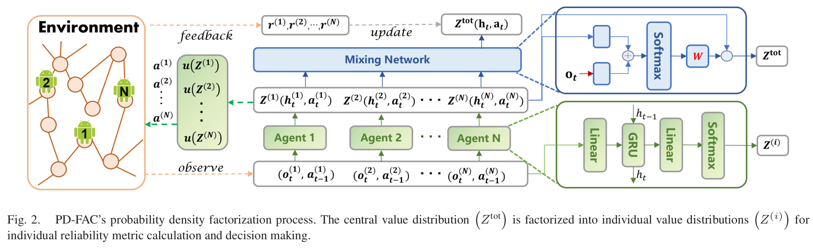
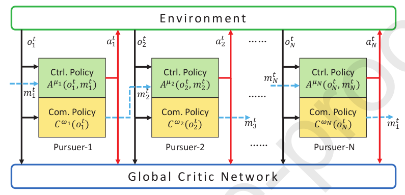
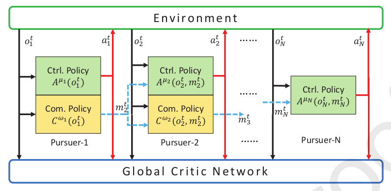

#### 1.《Distributed Reinforcement Learning for Coordinate Multi-Robot Foraging》(2010)

内容：介绍了一种改进智能体更新自己Q函数的方法(D-DCM-Multi-Q)，每个智能体考虑周边其他智能体的Q值对自己进行更新
$$
Q_{k+1, i}\left(s_i, a_i\right)=(1-\alpha) Q_{k, i}\left(s_i, a_i\right)+\alpha\left(R_{k, i}\left(s_i, a_i\right)+\gamma \sum_{j=1}^N f(i, j) V_{k, j}\left(s_i^{\prime}\right)\right)
$$
评价：对自己方法的解释和对应的公式之间存在矛盾，用的话可能要改一改？

#### 2. 《PD-FAC: Probability Density Factorized Multi-Agent Distributional Reinforcement Learning for Multi-Robot Reliable Search》

内容：解决多机可靠搜索问题，采用无向图的形式，将多机可靠搜索问题定义为了三个子问题

解决了两个网络训练的问题：

1. 联合观测与联合动作随着机器人数量的增加指数增加

   解决方法：引入概率密度因数分解

2. 观测不定长

   解决方法：引入GRU(gated recurrent unit)对状态进行编码，输出定长特征(状态为定长)

网络结构：

多机搜索分为两个分支：

- multi-robot efficient search (MuRES)

  协调一组机器人以最小化期望搜索努力定位移动目标点

- multi-robot guaranteed search (MuRGS)

  机器人最终找到目标点不管目标的感受和运动特点

### 3.《Cooperative Control for Multi-Player Pursuit-Evasion Games With Reinforcement Learning》

内容：使用了两种通信网络架构，MARL-Ring和MARL-line，而不是常用的广播通信的方式，减少了计算和通信资源，此外，通信网络是神经网络，将信息抽象后输入到策略网络和价值网络，这种方式其实就已经把其他机器人位置信息以及与目标的信息包括进来。**进行了丰富的实验对比和分析，后续可以参考**

MARL-ring(所有机器人知道目标点位置)

MARL-line(只有leader知道目标点位置，即Pursure-1)

